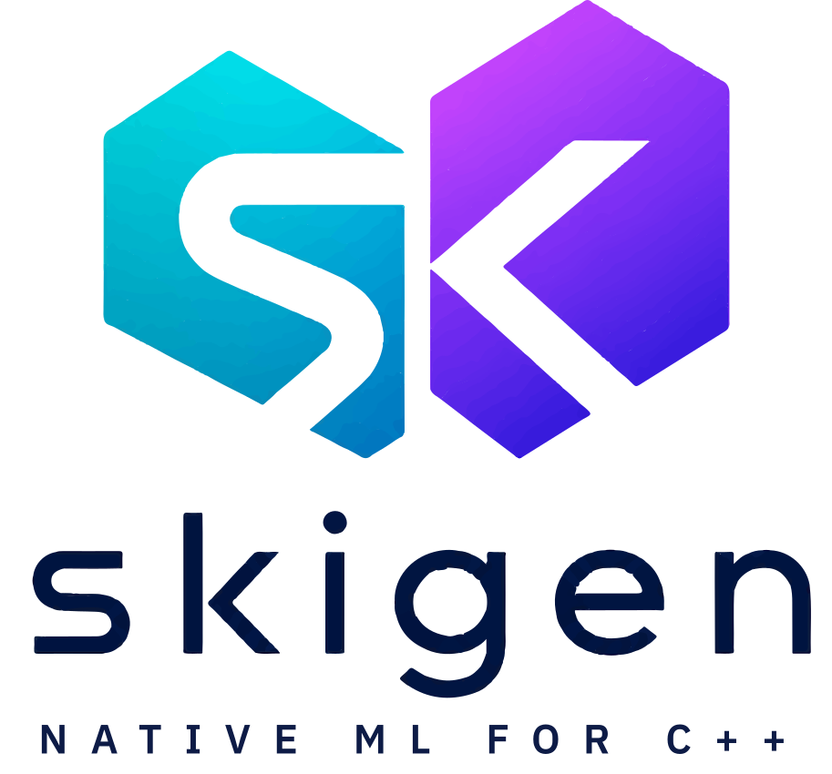

<p align="center">
  
</p>

<p align="center">
  <em>High-performance machine learning for modern C++ and Eigen.</em>
</p>

<p align="center">
  <a href="https://github.com/skigen-project/skigen/releases/latest"></a>&nbsp;
  <a href="https://github.com/skigen-project/skigen/actions/workflows/main.yml"></a>&nbsp;
  <a href="https://github.com/skigen-project/skigen/actions/workflows/staging.yml"></a>&nbsp;
  <a href="https://github.com/skigen-project/skigen/actions/workflows/codeql.yml"></a>
  <br>
  <a href="LICENSE"></a>&nbsp;
  <a href="https://skigen-project.github.io"></a>
</p>

-----------------

## About

Skigen is a header-only C++ template library for machine learning, built on [Eigen](https://eigen.tuxfamily.org/). It brings the [scikit-learn](https://scikit-learn.org/) API — `fit()`, `transform()`, `predict()` — to native C++.

- **Skigen is versatile.** Preprocessing, linear & Bayesian linear models, decomposition (incl. factor analysis), covariance estimation (Empirical/Ledoit-Wolf/OAS), clustering, trees, ensembles (random forests, gradient boosting, histogram GB), naive Bayes, SVMs (linear + kernel SMO), MLPs, manifold learning (Isomap/MDS/LLE/SpectralEmbedding/t-SNE/UMAP), neighbors (incl. local outlier factor), feature selection, calibration, isotonic regression, hyperparameter search (Grid/Randomized), pipelines, metrics — covering the scikit-learn 1.8.x surface with a consistent API.
- **Skigen is fast.** Eigen's expression templates, explicit SIMD vectorization, and compile-time polymorphism via CRTP. No interpreter, no garbage collector, no runtime dispatch.
- **Skigen is elegant.** Header-only — drop `Skigen/` next to `Eigen/` and `#include`. The same `fit` / `transform` / `predict` workflow, native to modern C++.

## Design

| Principle | Implementation |
|---|---|
| **Eigen-native** | Headers, namespaces, and include patterns mirror Eigen. `#include <Skigen/Dense>` feels like `#include <Eigen/Dense>`. |
| **Header-only** | Drop `Skigen/` next to `Eigen/` — no compiled libraries, no linker flags. |
| **Templatized** | All estimators accept `Scalar` (default: `double`). Switch to `float` for 2× SIMD throughput on the same hardware. |
| **Zero-copy** | Inputs use `Eigen::Ref<const MatrixType>` — supports sub-blocks and memory-mapped data without copying. |
| **CRTP** | Static polymorphism via the Curiously Recurring Template Pattern. Zero vtable overhead. |
| **Bit-level parity** | Results match scikit-learn for identical inputs and default parameters. Verified via cross-language parity tests. |

## Quick Start

```cpp
#include <Eigen/Dense>
#include <Skigen/Dense>
#include <iostream>

int main() {
    Eigen::MatrixXd X(4, 2);
    X << 1, 10,
         2, 20,
         3, 30,
         4, 40;

    Skigen::StandardScaler scaler;
    Eigen::MatrixXd Z = scaler.fit_transform(X);

    std::cout << "Standardized:\n" << Z << "\n";

    // Round-trip back to original scale
    Eigen::MatrixXd X_back = scaler.inverse_transform(Z);
    std::cout << "Recovered:\n" << X_back << "\n";

    return 0;
}
```

## Build & Test

```bash
git clone https://github.com/skigen-project/skigen.git
cd skigen

cmake -B build -DSKIGEN_BUILD_TESTS=ON
cmake --build build
./build/tests/skigen_tests
```

Eigen is detected automatically if installed system-wide, or from a sibling `../eigen` source tree.

## Include Pattern

Skigen follows the same convention as Eigen — module headers without file extensions:

```cpp
#include <Skigen/Core>           // Base classes, traits, concepts
#include <Skigen/Preprocessing>  // Scalers, normalizers, ...
#include <Skigen/Dense>          // Everything bundled
```

## Repository Layout

```
Skigen/                     # Header library (Eigen-style)
├── Core                    # Module header — base classes, traits, concepts
├── Preprocessing           # Module header — scalers, normalizers, ...
├── LinearModel             # Module header — regression, classification, Bayesian
├── CrossDecomposition      # Module header — PLSRegression, CCA
├── Decomposition           # Module header — PCA, TruncatedSVD, FactorAnalysis
├── Covariance              # Module header — Empirical, LedoitWolf, OAS
├── Anomaly                 # Module header — EllipticEnvelope, IsolationForest
├── Cluster                 # Module header — KMeans, MiniBatchKMeans
├── Neighbors               # Module header — KNN classifier/regressor, LOF
├── Tree                    # Module header — decision trees
├── Ensemble                # Module header — RandomForest, (Hist)GradientBoosting
├── NaiveBayes              # Module header — Gaussian/Multinomial/Bernoulli NB
├── SVM                     # Module header — Linear SVM, kernel SVM (SMO)
├── NeuralNetwork           # Module header — MLPClassifier, MLPRegressor
├── FeatureSelection        # Module header — VarianceThreshold, SelectKBest, ...
├── Manifold                # Module header — Isomap, MDS, LLE, SE, t-SNE, UMAP
├── Calibration             # Module header — CalibratedClassifierCV
├── Isotonic                # Module header — IsotonicRegression
├── ModelSelection          # Module header — split/CV, Grid/RandomizedSearchCV
├── Pipeline                # Module header — compile-time pipeline composition
├── Metrics                 # Module header — regression, classification, pairwise
├── Dense                   # Convenience header — bundles all modules
└── src/                    # Internal headers (.h)
    ├── Core/               # Traits, Concepts, Base, Validation, EigenHelpers
    ├── Preprocessing/      # StandardScaler, MinMaxScaler, MaxAbsScaler, ...
    ├── LinearModel/        # LinearRegression, Ridge, Lasso, BayesianRidge, ARD
    ├── CrossDecomposition/ # PLSRegression, CCA
    ├── Decomposition/      # PCA, TruncatedSVD, FactorAnalysis
    ├── Covariance/         # EmpiricalCovariance, LedoitWolf, OAS
    ├── Anomaly/            # EllipticEnvelope, IsolationForest
    ├── Cluster/            # KMeans, MiniBatchKMeans
    ├── Neighbors/          # KNeighborsClassifier, KNeighborsRegressor, LocalOutlierFactor
    ├── Tree/               # DecisionTreeClassifier, DecisionTreeRegressor
    ├── Ensemble/           # RandomForest, GradientBoosting, HistGradientBoosting
    ├── NaiveBayes/         # GaussianNB, MultinomialNB, BernoulliNB
    ├── SVM/                # LinearSVC, LinearSVR, SVC, SVR, Nu*/OneClassSVM
    ├── NeuralNetwork/      # MLPClassifier, MLPRegressor
    ├── FeatureSelection/   # VarianceThreshold, SelectKBest, SelectFromModel, RFE
    ├── Manifold/           # Isomap, MDS, LLE, SpectralEmbedding, TSNE, UMAP
    ├── Calibration/        # CalibratedClassifierCV
    ├── Isotonic/           # IsotonicRegression
    ├── ModelSelection/     # TrainTestSplit, CrossValidation, Grid/RandomizedSearchCV
    ├── Pipeline/           # Pipeline (compile-time)
    └── Metrics/            # Regression, Classification, Pairwise
tests/                      # Unit + parity tests
benchmarks/                 # Performance benchmarks
examples/                   # Usage examples (one per public estimator)
doc/                        # Requirements + Docusaurus website
```

## Requirements

| | Minimum |
|---|---|
| **C++ Standard** | Latest (currently C++23) |
| **Compilers** | GCC ≥ 13, Clang ≥ 17, MSVC ≥ 19.38 |
| **Eigen** | ≥ 3.4 |
| **CMake** | ≥ 3.20 (for building tests/examples) |

## License

Skigen is released under the [MIT License](LICENSE).

## Acknowledgments

Skigen builds on [Eigen](https://eigen.tuxfamily.org/) for numerical computation and adopts the API conventions established by [scikit-learn](https://scikit-learn.org/).
