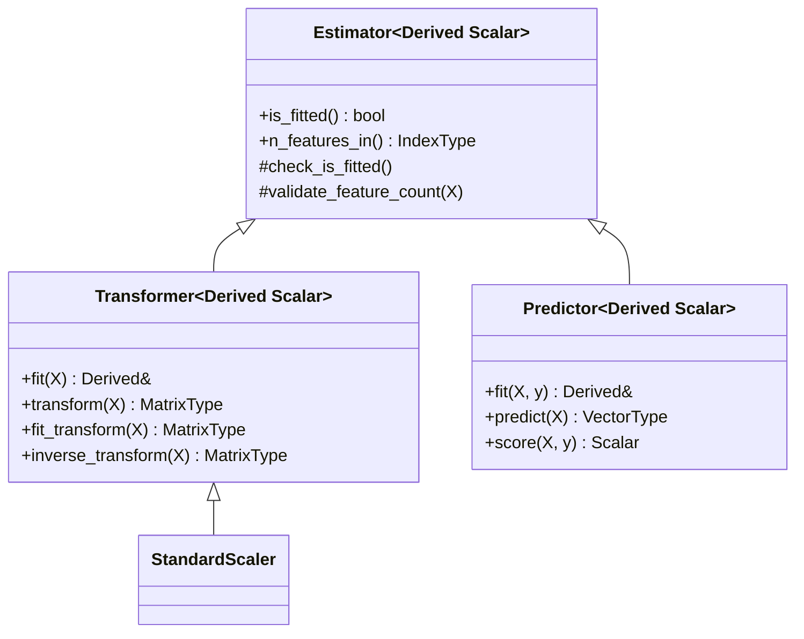

# Architecture

## Header Layout

Skigen follows the same directory convention as Eigen:

```
Skigen/
├── Core              # Module header (no extension)
├── Preprocessing     # Module header
├── Dense             # Convenience header — bundles all modules
└── src/
    ├── Core/
    │   ├── Traits.h        # EigenTypes<Scalar> type aliases
    │   ├── Concepts.h      # C++23 concepts (TransformerLike, PredictorLike)
    │   ├── Base.h          # CRTP bases (Estimator, Transformer, Predictor)
    │   ├── Validation.h    # Input validation
    │   └── EigenHelpers.h  # Numerical utilities
    └── Preprocessing/
        └── StandardScaler.h
```

Users include Skigen exactly like Eigen:

```cpp
#include <Eigen/Dense>         // Eigen
#include <Skigen/Dense>        // Skigen — same pattern
#include <Skigen/Core>         // or individual modules
#include <Skigen/Preprocessing>
```

## CRTP Base Classes

All estimators use the Curiously Recurring Template Pattern for zero-cost abstractions:



No `virtual` functions. No vtable. The compiler resolves all dispatch at compile time.

## Namespace

All code lives under `namespace Skigen`. Internal helpers live under `namespace Skigen::internal`.
